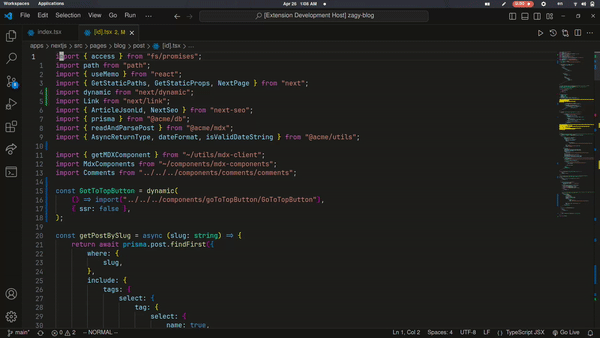

# Booker

extension inspired by [ThePrimeagen/harpoon](https://github.com/ThePrimeagen/harpoon), it gives you the ability to mark files to move between them blazingly fast, so simply move between files with the lsp then return to the important ones -without fuzzy finder- again blazingly fast!

## Features



- marks per workspace

- mark active file `booker.mark.add`

- remove the mark from active file `booker.mark.remove`

- show all marked files through vscode quickPick `booker.mark.show`

- hard coded jumps

  - jump to file at index 1 `booker.mark.jump1`

  - jump to file at index 2 `booker.mark.jump2`

  - jump to file at index 3 `booker.mark.jump3`

- reorder marks order though textEditor as you edit any file

## TODOS

- [ ] add mark to index[the default is at the tail]
- [ ] global marks

## Extension Settings

| Command           | Title                                        | Default Shortcut |
| ----------------- | -------------------------------------------- | ---------------- |
| booker.mark.add   | booker: add mark at current active editor    | TBD              |
| booker.mark.remove| booker: remove mark from current active editor| TBD              |
| booker.mark.show  | booker: show quick pick for all marked files | TBD              |
| booker.mark.jump1 | booker: jump to first mark                   | TBD              |
| booker.mark.jump2 | booker: jump to second mark                  | TBD              |
| booker.mark.jump3 | booker: jump to third mark                   | TBD              |
| booker.ui.show | booker: show booker ui                        | TBD              |

### vscodevim keybindings example

  ```json
        {
            "before": ["<leader>", "a"],
            "commands": ["booker.mark.add"]
        },
        {
            "before": ["<leader>", "r"],
            "commands": ["booker.mark.remove"]
        },
        {
            "before": ["<leader>", "1"],
            "commands": ["booker.mark.jump1"]
        },
        {
            "before": ["<leader>", "2"],
            "commands": ["booker.mark.jump2"]
        },
        {
            "before": ["<leader>", "3"],
            "commands": ["booker.mark.jump3"]
        }
  ```

## Release Notes

### 1.0.0

Initial release of Booker
